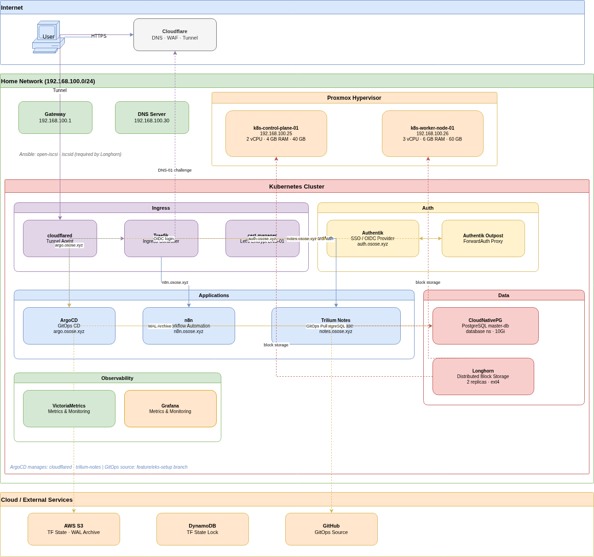

# homelab

A self-hosted Kubernetes platform running on bare metal Proxmox, managed entirely as code — Terraform provisions the VMs, Ansible bootstraps the OS layer, and ArgoCD keeps the cluster in sync with this repo.

Public services are exposed at **osose.xyz** via a Cloudflare tunnel. No ports are open on the router.

---

## Architecture



---

## Stack

| Layer | Technology |
|---|---|
| Hypervisor | Proxmox VE |
| IaC | Terraform (Telmate/proxmox provider) |
| Configuration management | Ansible |
| Kubernetes distribution | k3s |
| GitOps | ArgoCD |
| Ingress | Traefik |
| TLS | cert-manager + Let's Encrypt (DNS-01 via Cloudflare) |
| External access | Cloudflare Tunnel (`cloudflared`) |
| Identity / SSO | Authentik (OIDC provider for ArgoCD, Grafana, and app routes) |
| Storage | Longhorn (distributed block storage, 2 replicas) |
| Database | CloudNativePG (PostgreSQL operator) |
| DB backups | Barman Cloud Plugin → S3 + daily `ScheduledBackup` |
| Observability | VictoriaMetrics stack (VMSingle, VMAgent, VMAlert, Grafana, Alertmanager) |
| Notes | Trilium Notes |
| Automation | n8n |

---

## Repository Layout

```
homelab/
├── terraform/proxmox/      # VM provisioning — all nodes defined as code
├── ansible/
│   ├── inventory/          # Static inventory (k8s nodes + demo VMs)
│   ├── playbooks/          # install-deps.yml, bootstrap-demo.yml
│   └── roles/              # common, nginx, app, postgres, k3s-worker
├── k8s/
│   ├── argo-apps/          # ArgoCD Application CRDs (one file per app)
│   ├── charts/
│   │   ├── trilium-notes/  # Vendored Helm chart
│   │   └── values/         # Helm value overrides per release
│   └── manifest/
│       ├── auth/           # Authentik outpost, ForwardAuth middleware, IngressRoutes
│       ├── cnpg/           # CloudNativePG Cluster, ObjectStore, ScheduledBackup
│       └── monitoring/     # VMStaticScrape CRDs for VM exporters
└── docs/                   # Operational runbooks
```

---

## Interesting Details

### Zero open ports
All inbound traffic flows through a single Cloudflare Tunnel running as a Kubernetes `Deployment`. The tunnel process dials out to Cloudflare — no firewall rules needed, no ports forwarded. Adding a new public hostname is a one-line YAML change to `k8s/charts/values/cloudflared/values.yaml`; ArgoCD auto-syncs it within seconds.

### SSO on everything
Authentik runs as an OIDC provider and reverse-proxy outpost. ArgoCD and Grafana use native OIDC (`role:admin` and `Admin` role granted to members of their respective Authentik groups). Trilium Notes and n8n use Traefik's `ForwardAuth` middleware — the outpost validates the session and redirects to the Authentik login page if absent. One identity provider, one login prompt, across the whole platform.

### GitOps with ArgoCD multi-source
The `cloudflared` and `monitoring` ArgoCD Applications use the multi-source pattern: the Helm chart is pulled from its upstream registry, while the value overrides come from this Git repo. This means the chart version can be pinned and bumped in code, and value drift is impossible — the cluster always reflects what's in `main`.

### Database operator with WAL archiving
CloudNativePG manages a single-instance PostgreSQL cluster. Every WAL segment is shipped to S3 via the Barman Cloud Plugin, providing continuous archiving on top of the daily `ScheduledBackup`. Recovery bootstraps from the latest base backup and replays WAL — point-in-time recovery is available without any manual snapshot orchestration.

### Longhorn storage classes
Two StorageClasses (`longhorn-delete` / `longhorn-retain`) with different reclaim policies separate ephemeral workloads from production data. The `longhorn-retain` class is used for the CNPG cluster, Grafana, and VictoriaMetrics — a `kubectl delete pvc` on those workloads won't destroy the underlying volume.

### Observability across the cluster boundary
The VictoriaMetrics stack runs inside Kubernetes, but the bare-metal demo VMs expose Prometheus-compatible exporters (node_exporter, nginx-prometheus-exporter, postgres_exporter). `VMStaticScrape` CRDs tell VMAgent to scrape those endpoints directly by IP, bridging the two environments into a single Grafana instance without any push-based agents.

---

## Services

| Service | URL | Auth |
|---|---|---|
| ArgoCD | argo.osose.xyz | Authentik OIDC |
| Authentik | auth.osose.xyz | — |
| Trilium Notes | notes.osose.xyz | Authentik ForwardAuth |
| n8n | n8n.osose.xyz | Authentik ForwardAuth |
| Grafana | grafana.osose.xyz | Authentik OIDC |

---

## Docs

Operational runbooks live in [`docs/`](docs/):

- [`cnpg-s3-backup-restore.md`](docs/cnpg-s3-backup-restore.md) — CNPG backup/restore procedures with Barman Cloud Plugin
- [`cnpg-storage-migration.md`](docs/cnpg-storage-migration.md) — migrating the database cluster between StorageClasses
- [`db-query-troubleshooting.md`](docs/db-query-troubleshooting.md) — PostgreSQL slow query analysis with `pg_stat_statements` and `EXPLAIN ANALYZE`
- [`monitoring-stack-plan.md`](docs/monitoring-stack-plan.md) — VictoriaMetrics + Grafana + Alertmanager deployment reference
- [`trilium-notes.md`](docs/trilium-notes.md) — Trilium deployment and Authentik integration guide
