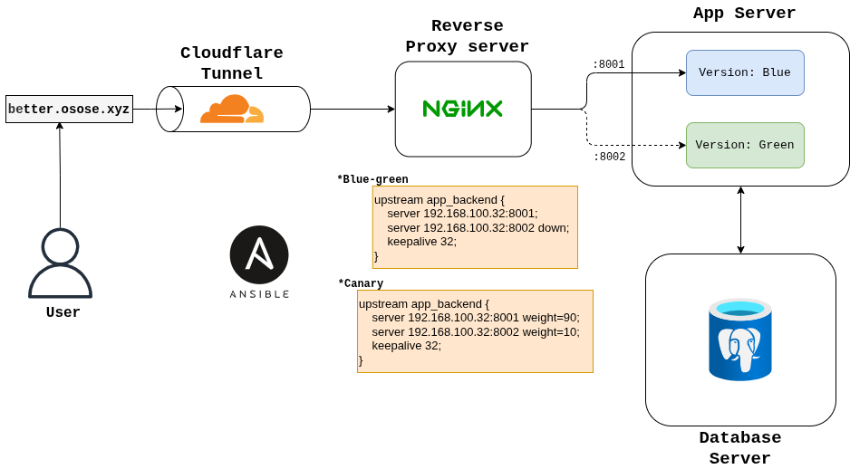

# Better — Production-Grade Traffic & Reliability Platform

A DevOps portfolio project demonstrating NGINX mastery, zero-downtime deployments, database performance engineering, full observability, and chaos/incident response — all on bare VMs without Kubernetes.

Live at **[better.osose.xyz](https://better.osose.xyz)**

---

## Architecture



Traffic enters through a Cloudflare tunnel and hits NGINX on `traffic-proxy-01`, which load-balances across two FastAPI instances (blue on `:8001`, green on `:8002`) running on `app-server-01`. Both instances share a PostgreSQL database on `postgres-01`. All three VMs expose Prometheus exporters that are scraped by VictoriaMetrics running in an existing Kubernetes cluster.

```
Internet
   │
   └── Cloudflare Tunnel (better.osose.xyz)
              │
              ▼
   ┌─────────────────────────┐
   │   traffic-proxy-01      │  192.168.100.31
   │   NGINX reverse proxy   │  :80
   │   nginx-prometheus-exp  │  :9113
   │   node_exporter         │  :9100
   └────────────┬────────────┘
                │  upstream: blue (:8001) / green (:8002)
                ▼
   ┌─────────────────────────┐
   │   app-server-01         │  192.168.100.32
   │   FastAPI (blue)        │  :8001
   │   FastAPI (green)       │  :8002
   │   node_exporter         │  :9100
   └────────────┬────────────┘
                │
                ▼
   ┌─────────────────────────┐
   │   postgres-01           │  192.168.100.33
   │   PostgreSQL 15         │  :5432
   │   postgres_exporter     │  :9187
   │   node_exporter         │  :9100
   └─────────────────────────┘
```

---

## What It Demonstrates

### Blue-Green Deployments (Zero Downtime)

Both the `blue` (`:8001`) and `green` (`:8002`) FastAPI instances run continuously on the app server. NGINX's `down` flag keeps the standby out of rotation. Cutover is driven entirely by an Ansible variable — no SSH, no manual file edits:

```bash
# Switch to green
ansible-playbook playbooks/bootstrap-demo.yml --limit demo_proxy -e active_version=green

# Roll back to blue
ansible-playbook playbooks/bootstrap-demo.yml --limit demo_proxy -e active_version=blue
```

The active version is visible in every response via the `X-App-Version` header and confirmed by the `/health` endpoint.

A canary variant is also possible by assigning weights instead of using the `down` flag:

```nginx
upstream app_backend {
    server 192.168.100.32:8001 weight=90;  # blue  — 90% of traffic
    server 192.168.100.32:8002 weight=10;  # green — 10% of traffic
    keepalive 32;
}
```

### NGINX as a Production Reverse Proxy

- Rate limiting: `limit_req_zone` at 30 req/s per IP, with a burst allowance of 50
- JSON-structured access logs (all fields including upstream addr and response time)
- `proxy_next_upstream` for automatic failover on 502/503
- Static frontend served with `try_files` and 1-hour cache headers
- Custom JSON error responses for 429 and 502/503

### Database Performance Engineering

The `products` table holds 1 million rows. The `GET /api/products?category=electronics` endpoint triggers a full sequential scan by default — query time sits around 800ms under load.

Adding an index with zero downtime:

```sql
CREATE INDEX CONCURRENTLY idx_products_category_created
  ON products (category, created_at DESC);
```

`CONCURRENTLY` builds the index without taking a table lock, so traffic keeps flowing. After the index is live, the same query drops to under 5ms. The before/after comparison in Grafana (via `pg_stat_statements`) is one of the core deliverables of this project.

### Observability Stack

VMs expose Prometheus-compatible metrics endpoints. VictoriaMetrics (running in the K8s cluster) scrapes them via `VMStaticScrape` CRDs. Grafana dashboards cover:

| Dashboard | What it shows |
|---|---|
| Node Exporter Full | CPU, memory, disk, network per VM |
| NGINX | Request rate, 4xx/5xx, upstream response time |
| PostgreSQL | Query throughput, slow queries, connection pool |

Alertmanager routes alerts via Gmail SMTP. Loki log aggregation is planned but not yet deployed.

### Chaos Engineering

Three reproducible failure scenarios, each tied to a runbook:

| Scenario | Trigger | Observable effect |
|---|---|---|
| Backend instance failure | Kill the blue uvicorn process | Error rate spikes → NGINX failover kicks in → alert fires |
| Slow query injection | Run `pg_sleep(10)` under load | `SlowQuery` alert fires → Grafana DB dashboard spikes |
| Traffic spike / rate limiting | k6 spike test (10 → 500 VUs) | 429s appear in NGINX logs → backend stays healthy |

---

## Application API

A realistic e-commerce-style FastAPI app backed by PostgreSQL.

| Endpoint | Description |
|---|---|
| `GET /health` | Health check — returns `{"status":"ok","version":"blue\|green"}` |
| `GET /api/products` | Paginated product list. Params: `?page`, `?limit` (max 100), `?category` |
| `GET /api/products/{id}` | Single product by ID |
| `POST /api/orders` | Create order. Validates stock (409 if insufficient), decrements atomically |
| `GET /api/orders` | Recent 50 orders with product name (JOIN) |
| `GET /api/stats` | Aggregates: total products, orders today, orders/min, avg order value, top categories |

Database: 1 million seeded products, `pg_stat_statements` enabled, slow query threshold at 500ms.

---

## Load Tests

Three k6 scripts in `load-tests/`:

| Script | Profile | Purpose |
|---|---|---|
| `load-normal.js` | 50 VUs, 5 min | Baseline — p95 < 500ms, error rate < 1% |
| `load-spike.js` | 10 → 500 VUs | Trigger rate limiting, verify backend stays clean |
| `load-db-stress.js` | 100 VUs, 2 min | Before/after index comparison on the products table |

```bash
k6 run load-tests/load-normal.js
# or against the public endpoint:
BASE_URL=https://better.osose.xyz k6 run load-tests/load-normal.js
```

---

## Infrastructure

All VMs provisioned via Terraform (Proxmox) and bootstrapped via Ansible.

| VM | IP | Role |
|---|---|---|
| traffic-proxy-01 | 192.168.100.31 | NGINX reverse proxy |
| app-server-01 | 192.168.100.32 | FastAPI blue + green |
| postgres-01 | 192.168.100.33 | PostgreSQL 15 |

VMs are cloned from a Debian 12 template. The [`bootstrap-demo.yml`](../../ansible/playbooks/bootstrap-demo.yml) playbook applies roles idempotently, from a clean clone to a fully configured host:

| Role | Path | What it configures |
|---|---|---|
| `common` | [`ansible/roles/common/`](../../ansible/roles/common/tasks/main.yml) | node_exporter, base packages, ufw |
| `nginx` | [`ansible/roles/nginx/`](../../ansible/roles/nginx/tasks/main.yml) | NGINX, stub_status, nginx-prometheus-exporter |
| `app` | [`ansible/roles/app/`](../../ansible/roles/app/tasks/main.yml) | Python venv, FastAPI blue/green systemd units |
| `postgres` | [`ansible/roles/postgres/`](../../ansible/roles/postgres/tasks/main.yml) | PostgreSQL 15, pg_stat_statements, postgres_exporter |

---

## Stack

- **IaC**: Terraform (Proxmox provider), Ansible
- **Proxy**: NGINX with nginx-prometheus-exporter
- **App**: Python 3, FastAPI, asyncpg, uvicorn, systemd
- **Database**: PostgreSQL 15, pg_stat_statements
- **Observability**: VictoriaMetrics, VMAgent, Grafana, Alertmanager (on K8s)
- **Load testing**: k6
- **Exposure**: Cloudflare tunnel (no ports open on the firewall)
